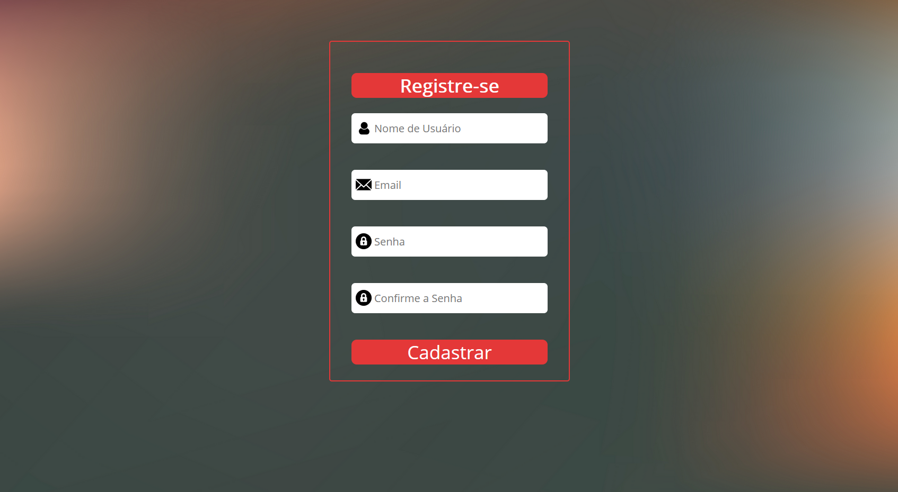
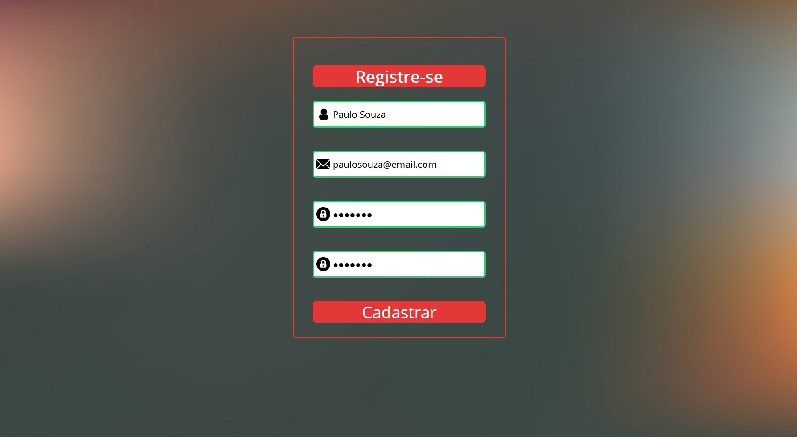
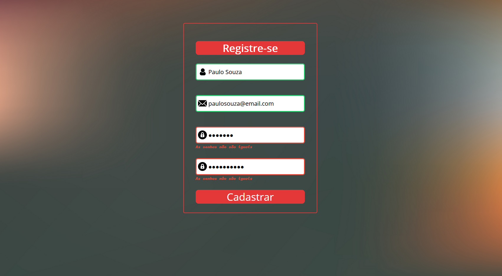
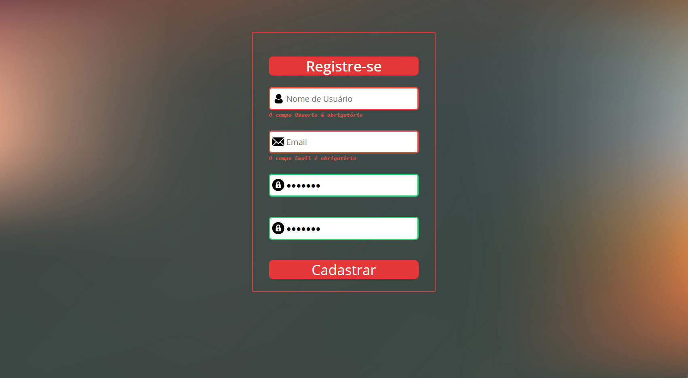

# Tela de Cadastro 
## Linguagens: HTML/CSS/JS

Register Frontend page with forms ready to receive inputs from the user. 
Front-end com os campos que serão preenchidos pelo usuário.
 
All inputs with success border and ready to submit. 
Todos os dados prontos e válidados para o cadastro.
 
Password must match to proceed. 
As senhas precisam ser iguais.
 
Must enter some data in order to continue with the validation. 
É necessário entrar com os dados para que o cadastro possa ser validado.

